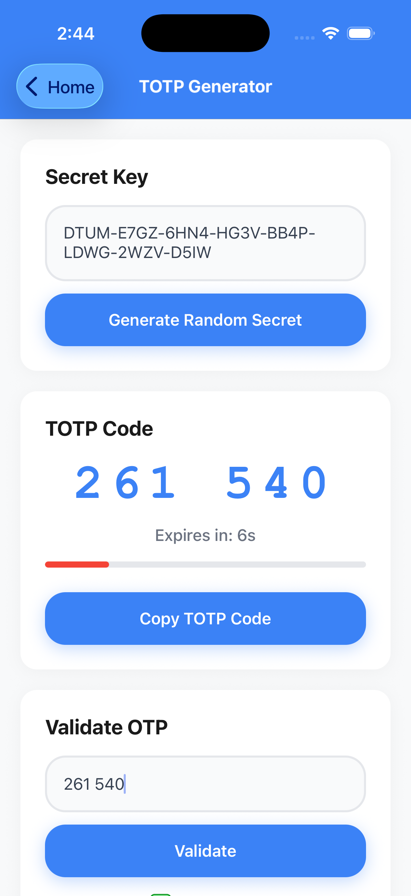
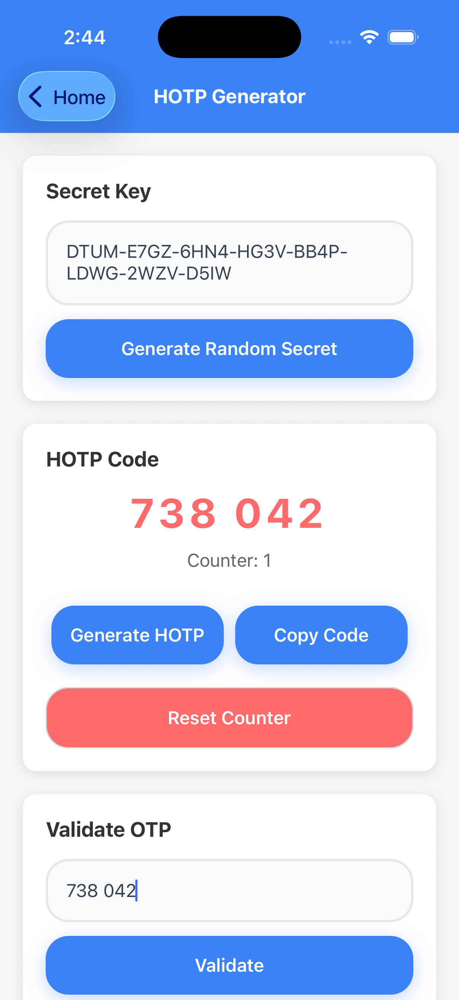
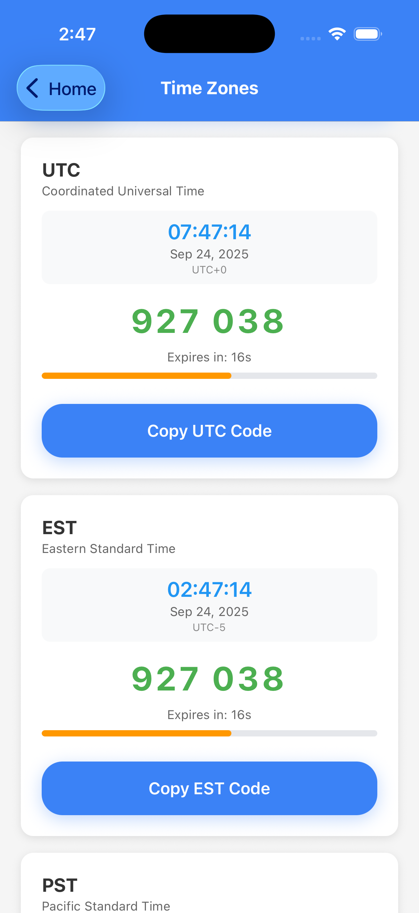

# react-native-nitro-totp

A high-performance React Native library for generating and validating Time-based One-Time Passwords (TOTP) and HMAC-based One-Time Passwords (HOTP) using [Nitro Modules](https://nitro.margelo.com/) for native performance.

## Quick Links

- [📱 Demo](#demo)
- [⭐ Features](#features)
- [⚡ Installation](#installation)
- [🚀 Quick Start](#quick-start)
- [📖 Example](#example)
- [📚 API Reference](#api-reference)
  - [🏛️ Classes](#classes)
    - [🔑 `NitroSecret`](#nitrosecret)
    - [⏰ `NitroTotp`](#nitrototp)
    - [🔢 `NitroHotp`](#nitrohotp)
  - [🛠️ Utility Functions](#utility-functions)
  - [📋 Types and Interfaces](#types-and-interfaces)
    - [🔐 Supported Algorithms](#supported-algorithms)
    - [📏 Secret Sizes](#secret-sizes)
    - [⚙️ Generation Options](#generation-options)
    - [✅ Validation Options](#validation-options)
    - [🔗 Auth URL Options](#auth-url-options)
- [💡 Usage Examples](#usage-examples)
  - [🔑 Secret Key Generation](#secret-key-generation)
  - [⏰ Basic TOTP](#basic-totp)
  - [🔒 Custom TOTP with SHA256](#custom-totp-with-sha256)
  - [🌍 TOTP with Custom Time (Time Zone Testing)](#totp-with-custom-time-time-zone-testing)
  - [🔢 HOTP with Counter](#hotp-with-counter)
  - [📱 Generating QR Code URLs](#generating-qr-code-urls)
  - [✅ Validation with Time Window](#validation-with-time-window)
  - [🕐 Validation with Custom Time](#validation-with-custom-time)
- [🎯 Best Practices](#best-practices)
  - [🔒 Security Considerations](#security-considerations)
  - [⚡ Performance Tips](#performance-tips)
  - [⚠️ Error Handling](#error-handling)
- [🔧 Troubleshooting](#troubleshooting)
  - [❗ Common Issues](#common-issues)
  - [📱 Integration with Popular Apps](#integration-with-popular-apps)
- [📱 Platform Support](#platform-support)
- [🤝 Contributing](#contributing)
- [📄 License](#license)
- [🙏 Acknowledgments](#acknowledgments)

## Demo

| TOTP | HOTP | Timezone |
|------|------|----------|
|  |  |  |

## Features

- 🚀 **Native Performance**: Built with Nitro Modules for maximum performance
- 🔐 **TOTP Support**: Generate time-based OTPs compatible with Google Authenticator, Authy, etc.
- 🔢 **HOTP Support**: Generate counter-based OTPs
- 🛡️ **Multiple Algorithms**: Support for SHA1, SHA256, and SHA512
- 📱 **QR Code URLs**: Generate otpauth:// URLs for easy QR code integration
- ✅ **Validation**: Built-in OTP validation with configurable time windows
- 🌍 **Custom Time Support**: Generate and validate OTPs for specific times (time zone testing, historical validation)
- 🔧 **Utility Functions**: Helper functions for formatting and parsing secret keys
- 📚 **TypeScript**: Full TypeScript support with comprehensive type definitions

## Installation

```bash
# npm
npm install react-native-nitro-totp react-native-nitro-modules

# yarn
yarn add react-native-nitro-totp react-native-nitro-modules

# pnpm
pnpm add react-native-nitro-totp react-native-nitro-modules
```

> **Note**: `react-native-nitro-modules` is required as this library relies on [Nitro Modules](https://nitro.margelo.com/) for native performance.

## Quick Start

```ts
import {
  formatOTP,
  formatSecretKey,
  isValidSecretKey,
  NitroSecret,
  NitroTotp,
  NitroHotp,
  parseSecretKey,
  SupportedAlgorithm,
  SecretSize,
} from 'react-native-nitro-totp';

// Create instances
const nitroSecret = new NitroSecret();
const nitroTotp = new NitroTotp();
const nitroHotp = new NitroHotp();

// Generate a secret key (default: 32 characters)
const secretKey = nitroSecret.generate();
const formattedSecret = formatSecretKey(secretKey);

// Or generate specific sizes
const compactSecret = nitroSecret.generate({ size: SecretSize.COMPACT });   // 26 chars
const standardSecret = nitroSecret.generate({ size: SecretSize.STANDARD }); // 32 chars
const extendedSecret = nitroSecret.generate({ size: SecretSize.EXTENDED }); // 52 chars

// Generate TOTP
const totpCode = nitroTotp.generate(parseSecretKey(formattedSecret));
console.log('TOTP Code:', formatOTP(totpCode)); // e.g., "123 456"

// Validate TOTP
const isValid = nitroTotp.validate(parseSecretKey(formattedSecret), totpCode);
console.log('Is valid:', isValid); // true

// Generate HOTP
const hotpCode = nitroHotp.generate(parseSecretKey(formattedSecret), { counter: 0 });
console.log('HOTP Code:', formatOTP(hotpCode)); // e.g., "654 321"
```

## Example

Here's a complete example showing all major features:

```ts
import React, { useState, useEffect, useCallback } from 'react';
import { View, Text, Button, TextInput } from 'react-native';
import {
  formatOTP,
  formatSecretKey,
  NitroSecret,
  NitroTotp,
  NitroHotp,
  parseSecretKey,
  SupportedAlgorithm,
  SecretSize,
} from 'react-native-nitro-totp';

export default function TotpExample() {
  const [secretKey, setSecretKey] = useState('');
  const [totpCode, setTotpCode] = useState('');
  const [timeRemaining, setTimeRemaining] = useState(30);

  // Create instances
  const nitroSecret = new NitroSecret();
  const nitroTotp = new NitroTotp();
  const nitroHotp = new NitroHotp();

  // Generate a new secret key (standard 32-character by default)
  const generateSecret = () => {
    const secret = nitroSecret.generate();
    const formatted = formatSecretKey(secret);
    setSecretKey(formatted);
  };

  // Generate different secret sizes
  const generateCompactSecret = () => {
    const secret = nitroSecret.generate({ size: SecretSize.COMPACT }); // 26 chars
    setSecretKey(formatSecretKey(secret));
  };

  const generateExtendedSecret = () => {
    const secret = nitroSecret.generate({ size: SecretSize.EXTENDED }); // 52 chars
    setSecretKey(formatSecretKey(secret));
  };
    setSecretKey(formatted);
  };

  // Generate TOTP code
  const generateTOTP = useCallback(() => {
    if (!secretKey || !nitroSecret.isValid(secretKey)) return;

    const secret = parseSecretKey(secretKey);
    const code = nitroTotp.generate(secret);
    setTotpCode(formatOTP(code));
  }, [secretKey]);

  // Generate Auth URL for QR codes
  const generateAuthURL = () => {
    if (!secretKey) return '';

    const secret = parseSecretKey(secretKey);
    return nitroTotp.generateAuthURL({
      secret,
      issuer: 'My App',
      label: 'user@example.com',
      algorithm: SupportedAlgorithm.SHA1,
      digits: 6,
      period: 30,
    });
  };

  // Update timer and regenerate TOTP when needed
  useEffect(() => {
    const interval = setInterval(() => {
      const now = Date.now();
      const timeLeft = 30 - Math.floor((now / 1000) % 30);
      setTimeRemaining(timeLeft);

      if (timeLeft === 30) {
        generateTOTP();
      }
    }, 1000);

    return () => clearInterval(interval);
  }, [generateTOTP]);

  return (
    <View style={{ padding: 20 }}>
      <Button title="Generate Secret" onPress={generateSecret} />

      <TextInput
        value={secretKey}
        onChangeText={setSecretKey}
        placeholder="Secret key"
        style={{ borderWidth: 1, marginVertical: 10, padding: 10 }}
      />

      <Text>TOTP Code: {totpCode}</Text>
      <Text>Time remaining: {timeRemaining}s</Text>

      <Button title="Generate TOTP" onPress={generateTOTP} />
    </View>
  );
}
```

## API Reference

### Classes

#### `NitroSecret`

Handles secret key generation and management.

```ts
const nitroSecret = new NitroSecret();

// Generate a new secret key
const secret = nitroSecret.generate(options?: GenerateSecretKeyOptions);

// Validate secret key format
const isValid = nitroSecret.isValid(secretKey: string, options?: GenerateSecretKeyOptions);
```

#### `NitroTotp`

Handles Time-based One-Time Password operations.

```ts
const nitroTotp = new NitroTotp();

// Generate TOTP
const code = nitroTotp.generate(secret: string, options?: NitroTotpGenerateOptions);

// Validate TOTP
const isValid = nitroTotp.validate(secret: string, otp: string, options?: NitroTotpValidateOptions);

// Generate Auth URL
const url = nitroTotp.generateAuthURL(options: OTPAuthURLOptions);
```

#### `NitroHotp`

Handles HMAC-based One-Time Password operations.

```ts
const nitroHotp = new NitroHotp();

// Generate HOTP
const code = nitroHotp.generate(secret: string, options?: NitroHotpGenerateOptions);

// Validate HOTP
const isValid = nitroHotp.validate(secret: string, otp: string, options?: NitroHotpValidateOptions);

// Generate Auth URL
const url = nitroHotp.generateAuthURL(options: OTPAuthURLOptions);
```

### Utility Functions

```ts
// Format OTP for display (adds space in middle)
formatOTP(otp: string): string // "123456" → "123 456"

// Format secret key for display (adds dashes)
formatSecretKey(secret: string): string // "JBSWY3DP..." → "JBSW-Y3DP-..."

// Parse formatted secret key back to plain string
parseSecretKey(secret: string): string // "JBSW-Y3DP-..." → "JBSWY3DP..."

// Validate OTP format
isValidOTP(otp: string, options?: BaseGenerateOptions): boolean
```

### Types and Interfaces

#### Supported Algorithms

```ts
enum SupportedAlgorithm {
  SHA1 = 0,    // Default, most compatible
  SHA256 = 1,  // More secure
  SHA512 = 2,  // Most secure
}
```

#### Secret Sizes

```ts
enum SecretSize {
  COMPACT = 0,   // 16 bytes = 26 Base32 characters (minimum secure)
  STANDARD = 1,  // 20 bytes = 32 Base32 characters (most common)
  EXTENDED = 2,  // 32 bytes = 52 Base32 characters (high security)
}
```

#### Generation Options

```ts
interface BaseGenerateOptions {
  digits?: number;              // Default: 6
  algorithm?: SupportedAlgorithm; // Default: SHA1
}

interface NitroTotpGenerateOptions extends BaseGenerateOptions {
  period?: number;              // Default: 30 seconds
  currentTime?: number;         // Unix timestamp in seconds, defaults to current time
}

interface NitroHotpGenerateOptions extends BaseGenerateOptions {
  counter?: number;             // Default: 0
}

interface GenerateSecretKeyOptions {
  size?: number | SecretSize;   // Default: SecretSize.STANDARD (20 bytes = 32 chars)
}
```


#### Validation Options

```ts
interface BaseValidateOptions extends BaseGenerateOptions {
  window?: number;              // Default: 1 (±1 time step tolerance)
}

interface NitroTotpValidateOptions extends BaseValidateOptions {
  period?: number;              // Default: 30 seconds
  currentTime?: number;         // Unix timestamp in seconds, defaults to current time
}

interface NitroHotpValidateOptions extends BaseValidateOptions {
  counter?: number;             // Default: 0
}
```

#### Auth URL Options

```ts
interface OTPAuthURLOptions extends BaseGenerateOptions {
  secret: string;               // Required: Base32 secret key
  issuer?: string;              // App/service name
  label?: string;               // Account identifier
  issuerInLabel?: boolean;      // Default: false
  period?: number;              // TOTP only, default: 30
  counter?: number;             // HOTP only, default: 0
}
```

## Usage Examples

### Secret Key Generation

```ts
import { NitroSecret, SecretSize, formatSecretKey } from 'react-native-nitro-totp';

const nitroSecret = new NitroSecret();

// Generate standard 32-character secret (default, most common)
const standardSecret = nitroSecret.generate();
const formattedStandard = formatSecretKey(standardSecret); // e.g., "JBSW-Y3DP-EHPK-3PXP-..."

// Generate different sizes using enum
const compactSecret = nitroSecret.generate({ size: SecretSize.COMPACT });   // 26 chars (minimum secure)
const extendedSecret = nitroSecret.generate({ size: SecretSize.EXTENDED }); // 52 chars (high security)

// Or using raw byte values (backward compatibility)
const customSecret = nitroSecret.generate({ size: 20 }); // 32 chars (same as STANDARD)

console.log('Compact (26 chars):', formatSecretKey(compactSecret));
console.log('Standard (32 chars):', formatSecretKey(standardSecret));
console.log('Extended (52 chars):', formatSecretKey(extendedSecret));
```

### Basic TOTP

```ts
import { NitroSecret, NitroTotp, formatOTP, parseSecretKey, SecretSize } from 'react-native-nitro-totp';

const nitroSecret = new NitroSecret();
const nitroTotp = new NitroTotp();

// Generate secret (32 chars by default)
const secret = nitroSecret.generate();
const code = nitroTotp.generate(secret);
const formattedCode = formatOTP(code); // "123 456"

// Or generate with specific size
const compactSecret = nitroSecret.generate({ size: SecretSize.COMPACT }); // 26 chars
const compactCode = nitroTotp.generate(compactSecret);
```

### Custom TOTP with SHA256

```ts
import { SupportedAlgorithm } from 'react-native-nitro-totp';

const code = nitroTotp.generate(secret, {
  algorithm: SupportedAlgorithm.SHA256,
  digits: 8,
  period: 60, // 1 minute intervals
});
```

### TOTP with Custom Time (Time Zone Testing)

The `currentTime` parameter allows you to generate TOTP codes for specific times, which is useful for testing across different time zones or generating codes for specific moments.

```ts
import { NitroTotp } from 'react-native-nitro-totp';

const nitroTotp = new NitroTotp();

// Generate TOTP for current time (default behavior)
const currentCode = nitroTotp.generate(secret);

// Generate TOTP for a specific time (Unix timestamp in seconds)
const specificTime = Math.floor(Date.now() / 1000); // Current time in seconds
const codeForTime = nitroTotp.generate(secret, {
  currentTime: specificTime
});

// Generate TOTP for different time zones
const utcTime = Math.floor(Date.now() / 1000);
const tokyoTime = utcTime + (9 * 3600); // UTC+9
const newYorkTime = utcTime - (5 * 3600); // UTC-5

const tokyoCode = nitroTotp.generate(secret, { currentTime: tokyoTime });
const newYorkCode = nitroTotp.generate(secret, { currentTime: newYorkTime });

// Generate TOTP for a specific date
const specificDate = new Date('2024-01-01T12:00:00Z');
const timestampForDate = Math.floor(specificDate.getTime() / 1000);
const codeForDate = nitroTotp.generate(secret, {
  currentTime: timestampForDate
});
```

> **Note**: The `currentTime` parameter expects a Unix timestamp in **seconds**, not milliseconds. Use `Math.floor(Date.now() / 1000)` to convert JavaScript's millisecond timestamps.

### HOTP with Counter

```ts
import { NitroHotp } from 'react-native-nitro-totp';

const nitroHotp = new NitroHotp();
let counter = 0;

const generateNextHOTP = () => {
  const code = nitroHotp.generate(secret, { counter });
  counter++; // Increment for next use
  return code;
};
```

### Generating QR Code URLs

```ts
// For TOTP (Google Authenticator compatible)
const totpUrl = nitroTotp.generateAuthURL({
  secret: parseSecretKey(secretKey),
  issuer: 'My Awesome App',
  label: 'user@example.com',
  algorithm: SupportedAlgorithm.SHA1,
  digits: 6,
  period: 30,
});

// For HOTP
const hotpUrl = nitroHotp.generateAuthURL({
  secret: parseSecretKey(secretKey),
  issuer: 'My Awesome App',
  label: 'user@example.com',
  algorithm: SupportedAlgorithm.SHA1,
  digits: 6,
  counter: 0,
});
```

### Validation with Time Window

```ts
// Allow ±1 time step (±30 seconds by default)
const isValid = nitroTotp.validate(secret, userEnteredOTP, {
  window: 1, // Accept codes from previous/current/next time step
});

// More permissive validation (±2 time steps)
const isValidPermissive = nitroTotp.validate(secret, userEnteredOTP, {
  window: 2, // Accept codes from ±60 seconds
});
```

### Validation with Custom Time

```ts
// Validate TOTP for current time (default behavior)
const isValidNow = nitroTotp.validate(secret, userEnteredOTP);

// Validate TOTP for a specific time (useful for testing or time zone handling)
const specificTime = Math.floor(Date.now() / 1000) - 30; // 30 seconds ago
const isValidForTime = nitroTotp.validate(secret, userEnteredOTP, {
  currentTime: specificTime,
  window: 1
});

// Example: Validate codes across different time zones
const validateForTimeZone = (secret: string, otp: string, timezoneOffsetHours: number) => {
  const utcTime = Math.floor(Date.now() / 1000);
  const zoneTime = utcTime + (timezoneOffsetHours * 3600);

  return nitroTotp.validate(secret, otp, {
    currentTime: zoneTime,
    window: 1
  });
};

// Validate for Tokyo time (UTC+9)
const isValidInTokyo = validateForTimeZone(secret, userEnteredOTP, 9);
```

## Best Practices

### Security Considerations

1. **Secret Key Storage**: Always store secret keys securely using:
   - iOS: Keychain Services
   - Android: Android Keystore
   - Consider using libraries like `react-native-keychain`

2. **Secret Key Generation**: Use the built-in `NitroSecret.generate()` for cryptographically secure keys
   - Default (32 chars): `nitroSecret.generate()` - Most compatible
   - Compact (26 chars): `nitroSecret.generate({ size: SecretSize.COMPACT })` - Minimum secure
   - Extended (52 chars): `nitroSecret.generate({ size: SecretSize.EXTENDED })` - High security

3. **Validation Windows**: Use appropriate time windows - larger windows are more user-friendly but less secure

4. **Algorithm Choice**:
   - SHA1: Most compatible with existing authenticator apps
   - SHA256/SHA512: More secure but ensure compatibility

### Performance Tips

1. **Instance Reuse**: Create class instances once and reuse them:
   ```ts
   // ✅ Good - create once, reuse
   const nitroTotp = new NitroTotp();

   // ❌ Avoid - creating new instances repeatedly
   const generateCode = () => new NitroTotp().generate(secret);
   ```

2. **Batch Operations**: When validating multiple OTPs, reuse the same instance

### Error Handling

```ts
import { isValidOTP, NitroSecret } from 'react-native-nitro-totp';

const nitroSecret = new NitroSecret();

const generateTOTP = (secretKey: string) => {
  // Validate secret key first
  if (!nitroSecret.isValid(secretKey)) {
    throw new Error('Invalid secret key format');
  }

  try {
    const secret = parseSecretKey(secretKey);
    return nitroTotp.generate(secret);
  } catch (error) {
    console.error('TOTP generation failed:', error);
    throw error;
  }
};

const validateTOTP = (secretKey: string, otp: string) => {
  // Validate inputs
  if (!nitroSecret.isValid(secretKey)) {
    return { valid: false, error: 'Invalid secret key' };
  }

  if (!isValidOTP(otp)) {
    return { valid: false, error: 'Invalid OTP format' };
  }

  try {
    const secret = parseSecretKey(secretKey);
    const valid = nitroTotp.validate(secret, otp);
    return { valid, error: null };
  } catch (error) {
    return { valid: false, error: 'Validation failed' };
  }
};
```

## Troubleshooting

### Common Issues

1. **"Invalid secret key" errors**:
   - Ensure the secret key is properly Base32 encoded
   - Use `formatSecretKey()` and `parseSecretKey()` for proper formatting
   - Check if the key length matches expected format

2. **TOTP codes don't match authenticator apps**:
   - Verify the time is synchronized on both devices
   - Check algorithm, digits, and period settings match
   - Default settings (SHA1, 6 digits, 30 seconds) work with most apps

3. **Performance issues**:
   - Reuse class instances instead of creating new ones
   - Avoid calling generation/validation in render loops

### Integration with Popular Apps

The library generates standard-compliant OTPs that work with:
- Google Authenticator
- Microsoft Authenticator
- Authy
- 1Password
- Bitwarden
- And any RFC 6238 (TOTP) / RFC 4226 (HOTP) compliant app

## Platform Support

- ✅ iOS 11.0+
- ✅ Android API 21+
- ✅ Expo (with development builds)
- ❌ Expo Go (requires native modules)

## Contributing

We welcome contributions! Please see our contributing guidelines:

- [Development workflow](CONTRIBUTING.md#development-workflow)
- [Sending a pull request](CONTRIBUTING.md#sending-a-pull-request)
- [Code of conduct](CODE_OF_CONDUCT.md)

## License

MIT License - see the [LICENSE](LICENSE) file for details.

## Acknowledgments

- Built with [Nitro Modules](https://nitro.margelo.com/) for native performance
- Implements [RFC 6238 (TOTP)](https://tools.ietf.org/html/rfc6238) and [RFC 4226 (HOTP)](https://tools.ietf.org/html/rfc4226) standards
- Created with [create-react-native-library](https://github.com/callstack/react-native-builder-bob)

---

<div align="center">
  <strong>⭐ Star this repo if it helped you! ⭐</strong>
</div>
